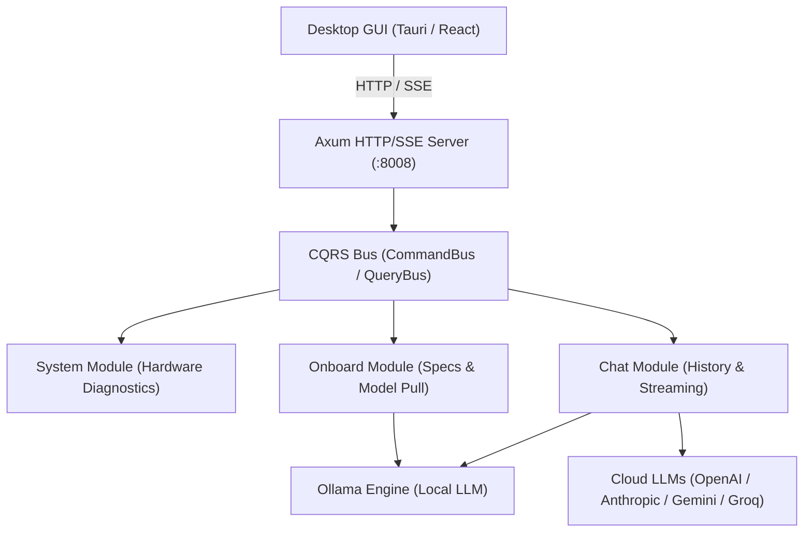

# Architecture & Design

Zyros is built as a hybrid local workstation assistant combining a high-performance **Rust (Axum)** engine with a responsive **React (TypeScript)** frontend, deployable as a native desktop client via **Tauri v2** or **pywebview**.

---

## 🏛️ System Architecture

---

## 🧩 Key Subsystems

### 1. CQRS Event Bus (`backend/src/shared/bus.rs`)
- **QueryBus**: Handles non-mutating data retrieval (e.g., system specifications, session lists, hardware scan).
- **CommandBus**: Handles state-modifying actions (e.g., saving API keys, creating chat sessions, downloading models).

### 2. Hardware Diagnostics (`backend/src/system/`)
Probes the host machine for:
- CPU model, physical and logical cores
- System RAM and available memory headroom
- Storage partitions and free disk space
- GPU vendors (NVIDIA, AMD, Intel) and driver acceleration status

### 3. Intelligence Orchestration (`backend/src/onboard/` & `backend/src/chat/`)
- Dynamically selects suitable GGUF model sizes based on available RAM/VRAM.
- Streams installation and progress feedback via Server-Sent Events (SSE).
- Supports switching between local models and bring-your-own-key (BYOK) cloud endpoints.

---

## 🎨 UI/UX Design System

- **Palette**: Warm minimalist parchment (`#faf5ea`) with contrast accents and clean neutral card surfaces (`#ffffff`).
- **Typography**: Display typography powered by **Clash Display** and classic serif accents with **Playfair Display**.
- **Window Management**: Seamless frameless boot splash screen transitioning into the main assistant canvas.
