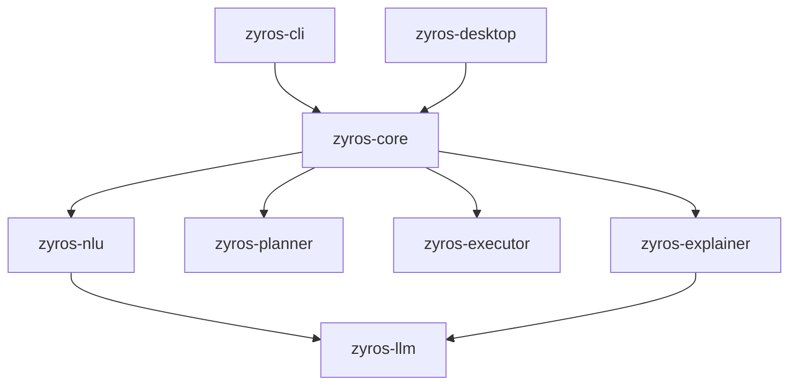

# Zyros

Zyros is a desktop AI-powered Linux operations assistant. It contains a Rust backend, a CLI wrapper, and a desktop daemon wrapped via Tauri.

## Architecture

### Components

1. **`zyros-cli`**
   - An interactive command-line REPL for diagnostics and system operations.
   - Supports keyboard history and line editing via `rustyline`.
   - Persists the last 100 commands to `.zyros_history` and appends all log events to `zyros.log`.

2. **`zyros-desktop` (`src-tauri`)**
   - A Tauri-based widget and terminal tray daemon running in the background.

3. **`zyros-core`**
   - The central orchestrator that coordinates system checks, intent parsing, execution allowlists, and explanation routines.

4. **`zyros-nlu`**
   - Natural Language Understanding engine. Combines Ollama-based intent classification with fast manual heuristics.
   - Features a fuzzy matching and subsequence algorithm (e.g. matching `brv` or `rave` to `Brave`) to resolve local application launching requests directly from `/usr/share/applications/`.

5. **`zyros-planner`**
   - Plans sequences of OS commands based on parsed intents (e.g. checking system RAM, disk capacity, listing active processes, stopping process PIDs, and running local network diagnostics).

6. **`zyros-commands`**
   - The template library containing OS command configurations (e.g. `ping`, `ip`, `nmcli`, `ps`, `kill`).

7. **`zyros-executor`**
   - Safely executes OS binaries using an allowlist security verification check.

8. **`zyros-explainer`**
   - Uses an LLM to generate plain-English explanations of raw command diagnostic outputs (like routing tables, Wi-Fi scans, and IP interface statistics).

9. **`zyros-llm`**
   - The HTTP communication client for the local Ollama daemon.
